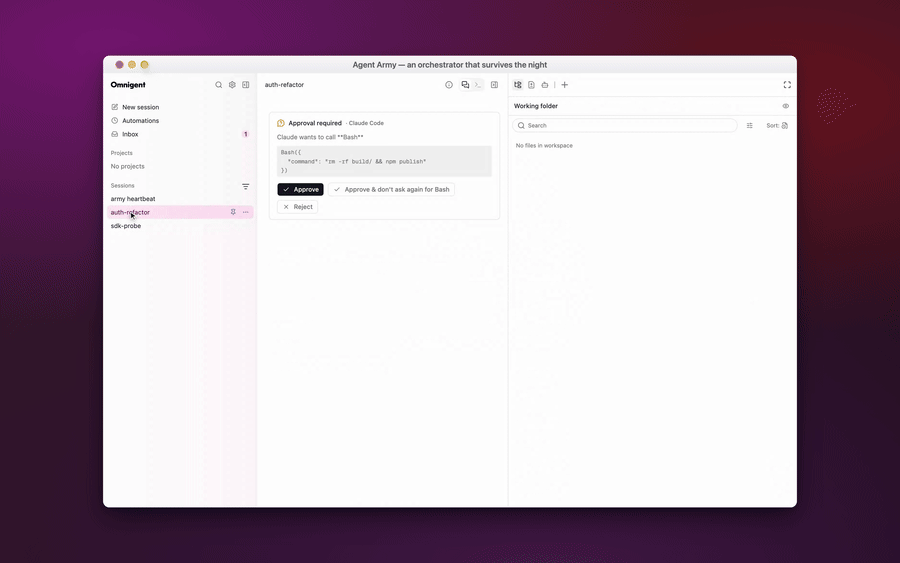

# Agent Army

An orchestrator for a team of coding agents running on six different vendors,
coordinated by a loop that keeps going after you close the laptop.



*Recorded against this repository — real sessions, a real Claude turn reading
`army/state.py`, and an approval card still answerable after the server was
SIGKILLed and restarted. The scenario is
[`media/agent-army.scenario.yaml`](media/agent-army.scenario.yaml); full-quality
MP4 is [`media/agent-army.mp4`](media/agent-army.mp4).*

It is two pieces that own different things:

| | Owns | Lives in |
|---|---|---|
| **Omnigent** | Sessions, harnesses, policies, sandboxes, the UI | this repository |
| **`army`** | The loop's own state — where each iteration got to, what it is waiting for | [`army/`](../../army) |

The split matters. Omnigent already has a durable database, durably checkpointed
conversations, and durable schedules. What it has nowhere to put is the loop's
*program counter*: a schedule that fires, a transcript that persists, and an
approval row that survives do not between them record that iteration 41 got as
far as asking you a question and is waiting for the answer. `army` is that one
missing thing and nothing else.

---

## Why it survives a restart

A loop written the obvious way holds its place in a Python stack — a `while`
loop, an `await`, a future parked on a human. All three die with the process,
and a coroutine cannot be revived: there is no way to hand a resurrected stack
the answer it was waiting for.

So the loop here holds no place at all. Every pass reads the runs out of SQLite,
advances each by one state, and returns:

```
READY → DISPATCHING → COLLECTING → EVALUATING → WAITING_HUMAN
                                                     │
                              CONTINUE ── PAUSED ── COMPLETED ── FAILED
```

Whether the previous pass ended by returning, by being killed, or by the machine
losing power makes no difference to the next one. A run interrupted while
collecting is still `COLLECTING`; the next pass collects it. That is the whole
of the recovery logic, which is why there is no separate recovery path to get
out of step with the rest.

Your answer arrives the same way — as a row, not a callback:

```bash
army approve a3f9c2 --choice merge
```

That records a command. Nothing needs to be running at the time. The next pass
picks it up and advances the run exactly once, guarded by a compare-and-swap on
a version number so two supervisors racing produce one move rather than two.

---

## Getting it running

### 1. Omnigent, on subscriptions

```bash
omnigent setup          # pick subscription auth, not an API key
omnigent server         # or: omni start, to run it in the background
omnigent host           # register this machine so sessions can run on it
```

Log each vendor's own CLI in separately — the harnesses read the credential the
vendor CLI wrote, and Omnigent stores none of them:

```bash
claude          # Anthropic subscription
codex           # OpenAI subscription
grok login --device-auth
kimi
pi
agy
```

Check that nothing keyed leaked in:

```bash
python -c "from army.gates import assert_agent_environment_is_clean as c; print(c() or 'clean')"
```

A non-empty list means an agent could reach a credential it should not have.
Grok's own auth hint offers `XAI_API_KEY` as an alternative to OAuth — that is
the usual way a subscription-only deployment quietly becomes a keyed one.

### 2. The roster

There are two ways in, and they are for different things.

**Drive the orchestrator yourself.** `agents/marshal/` is an agent directory,
so run it the way you run any other:

```bash
omnigent run agents/marshal/
```

[`agents/marshal/config.yaml`](../../agents/marshal/config.yaml) holds the rules
worth reading before you change anything: it writes no code, it merges nothing,
every diff is reviewed by a vendor that did not write it, and every iteration
ends by asking you. Its six workers live under `agents/marshal/agents/` and
differ only in harness and in what each vendor cannot do — Grok and Kimi cannot
spawn sub-agents, Antigravity cannot raise an approval, Pi is headless so there
is no terminal to take over. Those constraints are written into each config so
marshal routes around them instead of discovering them at 3am.

**Let `army` drive.** The control plane dispatches through the HTTP API, which
needs agents that exist in the catalog. Omnigent already seeds one per vendor:

```bash
curl -s localhost:6767/v1/agents | jq -r '.data[].name'
# claude-native-ui  codex-native-ui  kimi-native-ui
# pi-native-ui      antigravity-native-ui  grok  ...
```

Those are the names to put in `army.toml`. Note that `omnigent run <dir>`
materialises a *session-scoped* agent rather than adding a catalog row, so a
custom roster agent is reachable by running it, not by naming it in
`army.toml`.

### 3. The loop

```bash
cp docs/agent-army/army.toml.example army.toml
printf 'Add a --dry-run flag to the export command\n' > army-queue.txt
army run
```

`army run` ticks every ten seconds. Leave it in a terminal, under `launchd`, or
in tmux — it does not matter, because nothing is lost by killing it.

```bash
army status                      # what is in flight, what is waiting on you
army approve a3f9c2 --choice merge
army deny a3f9c2
army effects                     # external actions whose outcome a crash left unknown
```

---

## Doing your own work with it

The engine knows nothing about what the work is. Everything domain-specific
lives behind [`army/workload.py`](../../army/workload.py), which is five
methods:

| Method | Called when | Does |
|---|---|---|
| `acquire` | opening an iteration | take the next work item, or `None` when idle |
| `dispatch` | `READY → DISPATCHING` | start the sessions this iteration needs |
| `collect` | `COLLECTING` | check whether they finished; gather what they produced |
| `evaluate` | `EVALUATING` | turn the evidence into the question for the human |
| `apply` | a verdict arrives | decide what the answer means |

[`army/workloads/demo.py`](../../army/workloads/demo.py) is a working one: it
reads tasks from a text file, implements each on one vendor, reviews it on
another, and asks you before continuing. Copy it, change the five methods, point
`army.toml` at yours.

Keep the vocabulary on your side of that seam. If a change to the engine starts
needing a word from your domain, the change belongs in the workload.

---

## The three gates that never move

Three things always need you, and no amount of green CI substitutes:

- adding a **new dependency**,
- **live order execution or real funds**,
- any **unattended spend**.

These are enforced as a capability boundary rather than as a policy, because a
policy is not a boundary. A native harness has its own shell; an agent can edit
a manifest instead of calling a tool; an MCP server can expose a write path
nobody enumerated. Evaluation order proves a session policy cannot override an
admin one — it does not prove every route goes through the policy engine, and
several plainly do not.

So the agents simply do not hold the credential.
[`army/gates.py`](../../army/gates.py) runs the broker that does, in a different
process, and it refuses to act without a grant signed over a digest of the exact
operation, with an expiry. An approval for "merge PR 42" cannot be replayed as
"merge PR 43", and one you gave last week is not consent for tonight.
[`tests/army/test_gates.py`](../../tests/army/test_gates.py) is written as
bypass attempts rather than happy paths, which is the only way this kind of test
is worth anything.

The policy engine stays on as defence in depth and as the right place to raise a
question. It is just not the thing standing between an agent and your money.

---

## Quota

Every sub-agent on one vendor shares that vendor's single login and its quota.
So concurrency is bounded *per vendor*, and a single worker pool with a global
cap is the wrong shape — it will put eight sessions on Claude and none on Codex.

[`army/lanes.py`](../../army/lanes.py) gives each harness its own lane and its
own cooldown. A vendor that reports a rate limit puts only its own lane to
sleep. When every lane is full the loop leaves work in `READY` rather than
failing it, which is what backpressure should look like.

Omnigent's own budget policies are denominated in dollars — `cost_budget` and
`user_daily_cost_budget` both take `max_cost_usd` — so on subscription auth
there is no dollar signal and none of that machinery fires. Lanes are what
replaces it.

---

## Known edges

Worth knowing before you rely on this unattended.

**A mid-turn approval is not asked.** A policy `ASK` raised at `TOOL_CALL`,
`TOOL_RESULT`, `OUTPUT` or sub-agent start is collapsed to `DENY` rather than
put to you ([upstream #765](https://github.com/omnigent-ai/omnigent/issues/765)).
Only `INPUT`-phase asks actually ask. That is why the loop's own gate sits at an
iteration boundary: the question gates the *next* dispatch rather than parking
inside a turn.

**A parked turn can trip the idle watchdog.**
[#4854](https://github.com/omnigent-ai/omnigent/issues/4854) — a turn waiting on
a human emits only heartbeats, and heartbeats deliberately do not reset the
watchdog. The loop's barrier lives in `army`'s own state rather than in a parked
turn, so it is not exposed to this; anything you gate *inside* a turn is.

**A sub-agent result can strand its parent.**
[#3274](https://github.com/omnigent-ai/omnigent/issues/3274) — a terminal status
rejected with `missing_parent_inbox` is retried indefinitely and the parent waits
forever. `army` polls session state rather than relying on the inbox alone,
which sidesteps it at the cost of being less immediate.

**Approval persistence.** Outstanding approvals lived only in memory
([#5144](https://github.com/omnigent-ai/omnigent/issues/5144)); this fork carries
the fix. On stock Omnigent, a server restart loses the prompt while leaving the
sidebar badge asserting one is waiting.

---

## Where things are

```
army/                     the control plane
  state.py                the state machine and its fencing
  store.py                SQLite: runs, commands, effects
  supervisor.py           one tick = read, move once, write
  omni.py                 the Omnigent HTTP boundary
  lanes.py                per-vendor admission control
  gates.py                the capability boundary and its broker
  workload.py             the five-method seam
  workloads/demo.py       a working example
agents/marshal/           the orchestrator and its six workers
tests/army/               durability and bypass tests
```
